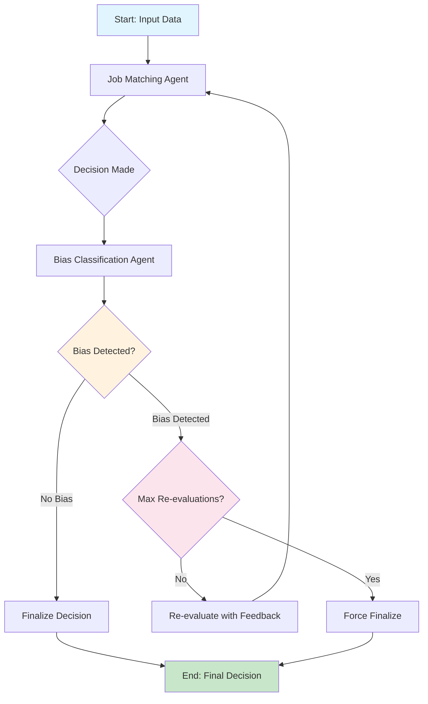

# Multi-Agent AI Hiring System

A two-agent architecture designed to improve fairness in AI-driven hiring decisions using LangGraph. The system separates decision-making from bias evaluation, creating a self-auditing recruitment pipeline.

## 📋 Table of Contents

- [System Status](#-system-status)
- [Quick Start](#-quick-start)
- [Features](#-features)
- [System Architecture](#-system-architecture)
- [Usage](#-usage)
- [Configuration](#-configuration)
- [Project Structure](#-project-structure)
- [Dataset Format](#-dataset-format)
- [Troubleshooting](#-troubleshooting)

### Project Documentation

- [Project Requirements](#1-project-requirements-summary)
- [Dataset Overview](#2-dataset-overview)
- [AI Model (Gemma 3)](#3-ai-model)
- [Multi-Agent Framework (LangGraph)](#4-multi-agent-framework)
- [Programming Language (Python)](#5-programming-language)
- [Implementation Phases](#6-implementation-phases)

---

## ✅ System Status

**🎉 FULLY OPERATIONAL** - Production-ready multi-agent AI hiring system with bias detection.

### Key Features:

- ✅ Multi-Agent Architecture with bias detection feedback loops
- ✅ LangGraph Integration with StateGraph and conditional routing
- ✅ Google Gemma 3 model integration
- ✅ API key management with multiple key rotation
- ✅ Production-ready error handling and logging

## 🚀 Quick Start

### Installation

1. **Run the setup script:**

   ```bash
   python setup.py
   ```

   This will automatically:

   - Create a virtual environment (`venv/`)
   - Install all required packages
   - Set up the `.env` configuration file

2. **Activate the virtual environment:**

   ```bash
   # Windows:
   venv\Scripts\activate

   # Linux/Mac:
   source venv/bin/activate
   ```

3. **Configure your API key:**
   Edit the `.env` file and add your Google API key:
   ```
   GOOGLE_API_KEY=your_actual_api_key_here
   ```

## 🚀 Features

- **Dual-Agent Architecture**: Job matching and bias detection agents
- **Self-Auditing Pipeline**: Automatic bias detection and re-evaluation
- **Multi-API Key Management**: Automatic rotation across multiple Google API keys
- **Memory Persistence**: Stateful workflow with checkpointing
- **Model Support**: Google Gemma 3 (27B-IT) model
- **Batch Processing**: Large-scale candidate evaluation
- **Chart Generation**: Visual analytics and reporting
- **Production-Ready**: Robust error handling and logging

## 🏗️ System Architecture

### Workflow Flow Diagram



### Agent 1: Job Matching Agent

- **Role**: Primary hiring decision-maker
- **Input**: Resume, Job Description, Interview Transcript, Role
- **Output**: Binary decision ("select" or "reject")
- **Focus**: Merit-based evaluation only

### Agent 2: Bias Classification Agent

- **Role**: Independent fairness auditor
- **Input**: All Agent 1 inputs + Decision
- **Output**: Bias classification ("biased" or "unbiased")
- **Focus**: Detecting non-merit influences

### Agent Communication

1. **Job Matching Agent** evaluates candidate and makes initial decision
2. **Bias Classification Agent** audits the decision for potential bias
3. **Re-evaluation Loop** triggers if bias detected (max 2 attempts)
4. **Final Decision** with comprehensive audit trail

## 📋 Requirements

- Python 3.8+
- Google API Key
- LangGraph and dependencies (auto-installed via setup.py)

## 💻 Usage

### Quick Commands

```bash
# Quick system test
python run.py

# Batch processing
python batch_processor.py

# Generate charts
python chart_generator.py

# Monitor API key usage
python -m key_manager.monitor_api_keys
```

### Python API

```python
from src.main import create_hiring_workflow

# Create and run workflow
app = create_hiring_workflow()
sample_data = {
    "job_posting": "Job requirements...",
    "candidate_profile": "Candidate resume...",
    "interview_transcript": "Interview notes...",
    "final_decision": None
}

# Process and get results
config = {"configurable": {"thread_id": "session_1"}}
final_state = app.invoke(sample_data, config)
print(f"Decision: {final_state['final_decision']}")
```

## ⚙️ Configuration

The system can be configured via `src/config.py`:

```python
class Config:
    # Model Configuration
    MODEL_NAME = "gemma-3-27b-it"        # Gemma 3 family model
    MODEL_TEMPERATURE = 0                # Low temperature for consistency

    # System Behavior
    MAX_RE_EVALUATIONS = 2               # Maximum bias re-evaluation attempts
    DEFAULT_DECISION_ON_ERROR = "reject" # Fallback decision on errors
    DEFAULT_BIAS_ON_ERROR = "unbiased"   # Conservative default
```

The system uses dynamic API key management from the `key_manager` module to handle multiple Google API keys automatically.

### Customizing Prompts

Edit the `PROMPTS` dictionary in `src/config.py`:

```python
PROMPTS = {
    "job_matching_initial": "Your custom hiring evaluation prompt...",
    "job_matching_feedback": "Your bias-aware re-evaluation prompt...",
    "bias_classification": "Your bias detection prompt..."
}
```

Test changes with: `python run.py`

## � Charts and Visualizations

The system generates comprehensive charts to analyze hiring decisions and bias detection performance. Run `python chart_generator.py` to create all visualizations.

### Generated Charts

- **evaluation_results.png** - Comprehensive 6-panel evaluation report (detailed below)
- **workflow_diagram.png** - LangGraph workflow visualization showing agent interactions
- **system_architecture.png** - Complete technical architecture diagram

### 📈 Evaluation Results Chart (evaluation_results.png)

This is the main analytical dashboard showing system performance across 6 detailed panels:

#### Panel 1: Decision Distribution (Top Left)

**Purpose:** Shows the proportion of "select" vs "reject" decisions made by the system.

**Calculation:** `(Decision Count / Total Candidates) × 100%`

**Value:** Helps identify if the system has decision bias toward accepting or rejecting candidates. A balanced distribution suggests fair evaluation, while extreme skew may indicate systemic issues.

**Example:** If 60% select, 40% reject → System may favor candidates

#### Panel 2: Bias Classification Distribution (Top Right)

**Purpose:** Shows how often the bias detection agent classified decisions as "biased" vs "unbiased".

**Calculation:** `(Bias Classification Count / Total Candidates) × 100%`

**Value:** Indicates the bias detection sensitivity. High bias detection rates may suggest either effective bias catching or over-sensitive detection. Low rates may indicate under-detection.

**Example:** If 15% biased, 85% unbiased → System detects bias in minority of cases

#### Panel 3: Re-evaluation Frequency (Middle Left)

**Purpose:** Shows how many attempts were needed before reaching a final decision.

**Calculation:** `Count of candidates by (re_evaluation_count + 1)`

- 1st Attempt = accepted immediately (re_evaluation_count = 0)
- 2nd Attempt = required 1 re-evaluation (re_evaluation_count = 1)
- 3rd Attempt = required 2 re-evaluations (re_evaluation_count = 2)

**Value:** Measures system efficiency and bias correction frequency. High re-evaluation rates indicate the bias detection is actively working but may suggest initial decision quality issues.

**Example:** If 80% accepted on 1st attempt → System makes good initial decisions

#### Panel 4: System Accuracy (Middle Right)

**Purpose:** Compares system decisions against ground truth labels (when available).

**Calculation:** `(Correct Predictions / Total Cases) × 100%`

- Decision Accuracy: `(Correct Final Decisions / Total Candidates) × 100%`
- Bias Detection Accuracy: `(Correct Bias Classifications / Total Candidates) × 100%`

**Value:** Direct measure of system performance. High accuracy indicates the system makes correct hiring decisions and properly identifies bias.

**Example:** 85% decision accuracy, 92% bias detection accuracy → Strong performance

#### Panel 5: Decision Changes Matrix (Bottom Left)

**Purpose:** Heatmap showing how often ground truth decisions were changed by the system.

**Calculation:** `(Count in Cell / Row Total) × 100%`

**Value:** Reveals system patterns in decision modification. Diagonal values show agreement with ground truth; off-diagonal values show corrections made.

**Example:** High "reject→select" changes may indicate bias correction in favor of candidates

#### Panel 6: Bias Analysis Stacked Distribution (Bottom Right)

**Purpose:** Three-category comparison of bias rates across the pipeline.

**Categories:**

- **Dataset:** Original bias distribution in ground truth
- **Agent Detection:** What the bias classifier detected
- **Correction Rate:** Percentage of biased cases successfully corrected

**Calculation:** `(Category Count / Total or Relevant Base) × 100%`

**Value:** Shows the complete bias correction pipeline effectiveness. Compares original bias levels, detection capability, and correction success.

**Example:** 20% dataset bias → 15% detected → 78% correction rate = effective bias reduction

### 🔄 Workflow Diagram (workflow_diagram.png)

Shows the LangGraph state machine with:

- **Node Flow:** START → Job Matcher → Bias Classifier → Decision Logic → END
- **Feedback Loops:** Re-evaluation paths when bias is detected
- **Conditional Logic:** `should_continue()` decision points
- **System Specs:** Model info, rate limits, memory management

### 🏗️ System Architecture (system_architecture.png)

Technical architecture showing:

- **Input Layer:** Resume, Job Description, Interview Transcript, Role
- **API Management:** Multi-key rotation, rate limiting
- **AI Agents:** Job matching and bias classification components
- **LangGraph Core:** StateGraph, checkpointing, conditional routing
- **Output Layer:** Final decisions, bias classifications, audit trails

## �📁 Project Structure

```
langgraph-hiring-system/
├── src/                          # Core source code
│   ├── config.py                 # Configuration and prompts
│   ├── main.py                   # LangGraph workflow
│   ├── rate_limiter.py           # Rate limiting utilities
│   └── agents/                   # Multi-agent components
│       ├── job_matching_agent.py # Hiring decision agent
│       └── bias_classification_agent.py # Bias detection agent
├── key_manager/                  # API key management
│   ├── api_key_manager.py        # Multi-key rotation system
│   └── monitor_api_keys.py       # Key monitoring utility
├── run.py                        # Main entry point
├── batch_processor.py            # Batch processing
├── chart_generator.py            # Analytics and charts
├── setup.py                      # Installation script
├── requirements.txt              # Dependencies
├── sample-data.csv               # Sample dataset
└── README.md                     # This file
```

## 📊 Dataset Format

Expected CSV format for evaluation:

| Column            | Description             | Required       |
| ----------------- | ----------------------- | -------------- |
| `ID`              | Candidate identifier    | Yes            |
| `Role`            | Position title          | Yes            |
| `Job_Description` | Position requirements   | Yes            |
| `Transcript`      | Interview conversation  | Yes            |
| `Resume`          | Candidate's resume text | Yes            |
| `decision`        | Ground truth decision   | For evaluation |
| `bias_label`      | Ground truth bias label | For evaluation |

**Example Ground Truth Labels:**

- `decision`: "select" or "reject"
- `bias_label`: "biased" or "unbiased"

## 🔧 Customization

### Adding New Models

Update `src/config.py`:

```python
class Config:
    MODEL_NAME = "gemini-1.5-pro"  # or your preferred model
    MODEL_TEMPERATURE = 0.5        # adjust as needed
```

### API Key Management

The system supports multiple API keys for increased quota:

- Set `GOOGLE_API_KEY` for single key usage
- Set `GOOGLE_API_KEY_1`, `GOOGLE_API_KEY_2`, etc. for multiple keys
- System automatically rotates between available keys

## 🐛 Troubleshooting

**Missing API Keys**: Ensure `GOOGLE_API_KEY` is set in `.env` file (or use numbered keys `GOOGLE_API_KEY_1`, etc.)

**Import Errors**: Run `pip install -r requirements.txt --force-reinstall`

**Environment Issues**: Activate virtual environment with `venv\Scripts\activate`

**API Quota**: Use multiple API keys for increased quota limits

**Quick Test**: Run `python run.py` to verify everything works

**Monitor Keys**: Run `python -m key_manager.monitor_api_keys` to check API key status

## 📝 Logging

Enable detailed logging: `logging.basicConfig(level=logging.DEBUG)`

## 🌐 Deployment

```bash
# Local development
python run.py

# Production: Use LangGraph Platform for scalability
```

---

## 1. Project Requirements Summary

### 1.1 General Objective

Build an advanced AI-based hiring system designed to ensure fairness and reduce bias in hiring decisions.

### 1.2 Functional Requirements

#### 1.2.1 System Architecture

The system must be based on an innovative architecture consisting of two intelligent agents: "Decision-Making Agent" and "Integrity Audit Agent".

#### 1.2.2 Decision-Making Agent

- Must be capable of analyzing candidate data (resume, interview) and issuing a preliminary decision of acceptance or rejection
- The agent's decision must be based exclusively on candidate qualifications and suitability for the job description

#### 1.2.3 Integrity Audit Agent

- Must work as an independent auditor to examine the first agent's decision
- Must be capable of determining whether the decision contains any undeclared biases

#### 1.2.4 Feedback Mechanism

- The system must activate a "feedback loop" when any suspicion of bias is detected
- The mechanism must include informing the decision-making agent of the need to reconsider its decision to ensure a more fair and objective evaluation process

### 1.3 Technical Requirements

#### 1.3.1 Large Language Models (LLMs)

- The project must rely on open-source large language models (such as LLaMA or Mistral)
- These models must be customized and trained precisely on realistic hiring datasets

#### 1.3.2 Orchestration Framework

- Must use specialized frameworks (such as LangChain or AutoGen) to coordinate interaction between the two agents and ensure smooth workflow

## 2. Dataset Overview

### 2.1 General Overview

For training and evaluating the system, a comprehensive synthetic dataset (fullDataset.csv) created by AI models will be used to simulate realistic hiring scenarios. This data is designed to test the system's ability to make accurate and unbiased hiring decisions.

### 2.2 Data Structure

The dataset contains the following columns for each candidate:

- **ID:** Unique identifier for each record
- **Role:** Job title the candidate applied for
- **Job_Description:** Job description for the vacant position
- **Transcript:** Interview text conducted with the candidate
- **Resume:** Complete resume of the candidate
- **decision:** Final decision made (select/reject) - Essential for training the "Decision-Making Agent"
- **bias_label:** Label indicating whether the decision was biased or not (biased/unbiased) - Vital for training the "Integrity Audit Agent"

### 2.3 Dataset Sample

| ID        | Role                  | Job_Description                                                                                                                            | Transcript                                                                                                               | Resume                                                                                | decision | bias_label |
| :-------- | :-------------------- | :----------------------------------------------------------------------------------------------------------------------------------------- | :----------------------------------------------------------------------------------------------------------------------- | :------------------------------------------------------------------------------------ | :------- | :--------- |
| jasojo159 | E-Commerce Specialist | Be part of a passionate team at the forefront of machine learning as an E-commerce Specialist, delivering solutions that shape the future. | Interviewer: Good morning, Jason. It's great to meet you. Welcome to the interview for the E-commerce Specialist role... | Jason Jones E-commerce Specialist Contact Information: Email: jasonjones@email.com... | reject   | unbiased   |

## 3. AI Model

### 3.1 About Gemma 3

Gemma 3 is a new family of open models from Google that are multimodal, capable of processing both text and images to generate textual outputs. These models are available in different sizes (1B, 4B, 12B, and 27B parameters) and come in pre-trained and instruction-tuned versions.

### 3.2 Key Features

- **Large Context Window:** Features a massive context window of up to 128,000 tokens
- **Multilingual Support:** Supports more than 140 languages
- **Multiple Tasks:** Suitable for tasks such as question answering, summarization, and reasoning
- **Resource Requirements:** Designed to be deployable in resource-limited environments, enhancing broader access to advanced AI. The largest model in the family (27B) requires at least 62GB of video memory (VRAM) for text-based tasks

### 3.3 Selection Reasons

- Easy to use via Google Gemini API, providing flexibility without local deployment
- Free usage through Google Gemini API without incurring usage costs
- High accuracy, reliability, multilingual support, open source, and comprehensive documentation
- Local availability using Ollama

## 4. Multi-Agent Framework

### 4.1 About LangGraph

LangGraph is a library for building stateful applications, designed for creating complex LLM (Large Language Model) applications. It was created to be part of the LangChain ecosystem and provides developers with greater control over agent behavior.

### 4.2 Key Features

- **Controllable Cognitive Architecture:** Provides a flexible framework supporting various control flows, enabling the creation of powerful agents capable of handling complex scenarios
- **Flexible and Customizable Workflow:** Offers low-level basic modules allowing creation of fully customized agent workflows
- **Persistent Context:** Includes built-in memory for storing conversation logs and maintaining context over time, leading to richer and more personalized interactions
- **Deployment and Scaling:** Provides infrastructure for deploying and scaling applications with horizontally scalable servers, task queues, and built-in persistence

### 4.3 Selection Reasons

- Simple learning curve allowing greater focus on improving results rather than writing code
- Flexibility in usage and management allowing implementation of different ideas without constraints
- Compatibility with a wide range of LLMs including Gemma 3, providing flexibility in switching between models

## 5. Programming Language

### 5.1 About Python

Python is a high-level, interpreted programming language known for its simplicity and ease of reading and writing. Python has become the dominant language in data science, artificial intelligence, and machine learning fields thanks to its rich and powerful ecosystem.

### 5.2 Key Features

- **Simplicity and Ease of Learning:** Features a simple structure resembling English, reducing the learning curve and allowing developers to focus on problem-solving rather than linguistic complexities
- **Extensive Libraries and Frameworks:** Possesses a vast ecosystem of specialized libraries serving all project aspects such as data handling, artificial intelligence, and API communication

### 5.3 Selection Reasons

- **Standard AI Language:** All specified project technologies (LangGraph, Gemma) have primary support and official libraries for Python, making integration straightforward
- **Development and Prototyping Speed:** Language simplicity allowed rapid experimentation between different frameworks (CrewAI then LangGraph) and iterative prompt improvement
- **Data Processing Efficiency:** To leverage the dataset, Python provides powerful tools through the Pandas library for data cleaning, analysis, and relabeling

## 6. Implementation Phases

### 6.1 Planning Phase

#### 6.1.1 Dataset Study

- **Objective:** Understand the dataset nature and quality
- **Steps:**
  1. Read a random sample of 100 records out of 10,175 total records
  2. Search for duplicates and fix them
  3. Create charts to understand data nature more deeply
- **Result:** Dataset appears clean and high-quality at first glance, some ID duplicates were fixed
- **Conclusion:** Continue using the dataset with relabeling to improve labeling quality

#### 6.1.2 Requirements Analysis

- **Objective:** Understand project requirements precisely and write a plan
- **Steps:**
  1. Read project requirements document
  2. Divide requirements into functional and non-functional
  3. Research to select LLM Model and Multi-Agent Framework
  4. Draw preliminary data flow diagram
- **Result:** Clear plan including tech stack and expected data flow

### 6.2 Labeling Phase

#### 6.2.1 Building Labeling System

- **Objective:** Improve dataset quality through relabeling based on clear criteria
- **Steps:**
  1. Write clear criteria and instructions and add them to prompts
  2. Develop simple labeling demo processing 100 records
  3. Examine results, improve prompts, and retry
  4. Develop labeling system capable of processing 10,000 records
- **Result:** Dataset with significantly fewer logical errors using clear labeling criteria

### 6.3 System Development Phase

#### 6.3.1 Multi-Agent System with CrewAI

- **Objective:** Initial Multi-Agent system covering project requirements
- **Steps:**
  1. Research CrewAI documentation for latest updates and implementation methods
  2. Develop Python script using CrewAI covering project requirements
  3. Test system and fix issues
- **Result:** Despite CrewAI mentioning Gemma3 compatibility, there are many limitations
- **Conclusion:** Stop using CrewAI and try another framework

#### 6.3.2 Multi-Agent System with LangGraph

- **Objective:** Initial Multi-Agent system covering project requirements
- **Steps:**
  1. Research LangGraph documentation for latest updates and implementation methods
  2. Develop Python script using LangGraph covering project requirements
  3. Test system and fix issues
- **Result:** Multi-Agent system working well, processing data and making decisions
- **Conclusion:** LangGraph provides better environment for handling smaller models

### 6.4 Report Development Phase

#### 6.4.1 Creating Reports

- **Objective:** Develop simple and dynamic reports that are easy to generate
- **Steps:**
  1. Re-examine project requirements and database for key indicators
  2. Select key indicators and best display methods
  3. Develop script capable of producing dynamic reports when data is available
  4. Test system and fix issues
- **Result:** System capable of creating reports dynamically

### 6.5 Performance Optimization Phase

#### 6.5.1 Rate Limiting Control System

- **Objective:** Develop system ensuring Gemma API rate limits aren't exceeded while minimizing downtime
- **Steps:**
  1. Research Gemma API documentation about rate limits and best practices
  2. Develop system considering Gemma API rate limits
  3. Extract 5 different Gemma API keys
  4. Develop system capable of switching between 5 keys to avoid downtime
  5. Test system and fix errors
- **Result:** System capable of working around Gemma API rate limits and avoiding downtime
- **Rate Limits:**
  - Requests per minute: 30
  - Tokens per minute: 15,000
  - Requests per day: 14,400

### 6.6 Accuracy Improvement Phase

#### 6.6.1 Prompt and Interaction Enhancement

- **Objective:** Improve result quality and achieve higher accuracy with lower bias rates
- **Steps:**
  1. Re-read and evaluate prompts
  2. Add ability to explain decision reasoning and analyze LLM-provided reasons
  3. Rewrite prompts based on provided reasons
  4. Add direct interaction capability between agents and test results
  5. Improve prompts to determine interaction length and method
  6. Test system and fix errors
- **Result:** System with high capability for making logical and unbiased decisions

### 6.7 Final Evaluation Phase

#### 6.7.1 Conducting Final Assessment

- **Objective:** Comprehensive final report covering all 10,000 records
- **Steps:**
  1. Run performance and accuracy optimized system
  2. Print results in reviewable format
  3. Create comprehensive final report
  4. Document project steps and final results
- **Result:** Comprehensive final report, project documentation, and dataset including new results

---

## 🔗 Resources

- [LangGraph Documentation](https://langchain-ai.github.io/langgraph/)
- [LangChain Documentation](https://python.langchain.com/)
- [Google Gemini API](https://ai.google.dev/)

**Built with LangGraph** - Multi-agent AI for fair hiring decisions.
