# Multi-Agent AI Hiring System - RunPod Optimized

A sophisticated two-agent architecture designed for **high-performance, bias-free hiring decisions** on RunPod infrastructure. This RunPod-optimized branch leverages **local Ollama with Gemma 3 27B** for maximum throughput and cost efficiency, specifically tuned for **H100 GPU clusters**.

## 🚀 RunPod Quick Start

### Instant Deployment (Recommended)

```bash
# Complete fresh pod setup (includes everything)
./deploy_fresh_pod.sh
```

### Manual Setup

```bash
# 1. Initial environment setup
./runpod_setup.sh

# 2. Start the optimized system
python run_on_runpod.py

# 3. Begin batch processing
python runpod_batch_processor.py --input sample-data.csv
```

### Performance Monitoring

```bash
# Monitor real-time performance
python performance_monitor.py

# System health check
./test_system.sh
```

## 📋 Table of Contents

- [RunPod Features](#-runpod-features)
- [System Status](#-system-status)
- [Installation & Setup](#-installation--setup)
- [Usage](#-usage)
- [System Architecture](#-system-architecture)
- [Performance Optimization](#-performance-optimization)
- [RunPod Configuration](#-runpod-configuration)
- [Project Structure](#-project-structure)
- [Troubleshooting](#-troubleshooting)
- [Advanced Features](#-advanced-features)

---

## 🎯 RunPod Features

### **⚡ High-Performance Optimizations**

- **H100 GPU Acceleration**: Optimized for 94GB VRAM with 95% utilization
- **Local Ollama Deployment**: Zero API costs, maximum throughput
- **Smart Resume Functionality**: Automatic continuation from interruptions
- **Concurrent Processing**: Up to 10 parallel candidate evaluations
- **GPU Layer Optimization**: Force all 63 model layers to GPU

### **🛡️ Production-Ready Features**

- **Auto-Recovery**: Robust error handling and automatic restarts
- **Smart Rate Limiting**: Optimized for local processing without API limits
- **Memory Management**: Efficient large-scale batch processing (10K+ candidates)
- **Real-time Monitoring**: Performance metrics and GPU utilization tracking
- **Comprehensive Logging**: Detailed operation tracking and debugging

### **🔄 Smart Resume System**

- **Automatic Detection**: Scans existing results to avoid reprocessing
- **ID Matching**: Intelligent candidate identification and filtering
- **Seamless Continuation**: Resumes exactly where processing stopped
- **Force Reprocessing**: Option to override and reprocess all candidates

---

## ✅ System Status

**🎉 PRODUCTION-READY ON RUNPOD** - Optimized for high-throughput processing with local Ollama

### Key Capabilities:

- ✅ **RunPod H100 Optimization**: Maximum GPU utilization (95% of 94GB VRAM)
- ✅ **Local Ollama Integration**: Gemma 3 27B model with zero API costs
- ✅ **Smart Resume**: Automatic continuation from interruptions
- ✅ **Concurrent Processing**: 10+ parallel candidate evaluations
- ✅ **GPU Layer Fix**: All 63 model layers properly offloaded to GPU
- ✅ **Real-time Monitoring**: Performance tracking and health checks
- ✅ **Batch Processing**: Large-scale dataset handling (10K+ candidates)
- ✅ **Auto-Recovery**: Robust error handling and restart mechanisms

## 🛠️ Installation & Setup

### Prerequisites

- **RunPod Account**: With H100 GPU access
- **Ubuntu 22.04+**: RunPod template compatibility
- **Minimum Resources**: H100 GPU (80GB+ VRAM recommended)

### Option 1: Automated Deployment (Recommended)

```bash
# Clone the RunPod branch
git clone -b runpod https://github.com/IbraheemAlz/langgraph.git
cd langgraph

# Run complete setup and deployment
./deploy_fresh_pod.sh
```

### Option 2: Manual Setup

```bash
# Step 1: Environment setup
./runpod_setup.sh

# Step 2: Start Ollama with H100 optimization
python run_on_runpod.py

# Step 3: Verify system health
./test_system.sh
```

### What Gets Installed:

- **Ollama**: Local LLM inference engine
- **Gemma 3 27B**: High-performance language model
- **Python Dependencies**: All required packages
- **GPU Optimization**: H100-specific configuration
- **Monitoring Tools**: Performance tracking utilities

## 📖 Usage

### 🚀 High-Performance Batch Processing

#### Basic Batch Processing

```bash
# Process all candidates in a CSV file
python runpod_batch_processor.py --input sample-data.csv

# Process with custom settings
python runpod_batch_processor.py --input data.csv --max-candidates 5000 --concurrent 15
```

#### Smart Resume Functionality

```bash
# First run (processes candidates, may get interrupted)
python runpod_batch_processor.py --input large_dataset.csv

# Automatic resume (skips already processed candidates)
python runpod_batch_processor.py --input large_dataset.csv
# Console will show: "✅ Already processed: 847 candidates, 🔄 Remaining: 9327"

# Force reprocess everything (ignore existing results)
python runpod_batch_processor.py --input large_dataset.csv --force
```

#### Real-time Monitoring

```bash
# Monitor performance in another terminal
python performance_monitor.py

# Quick system status check
./test_system.sh
```

### 🔧 System Management

#### GPU Optimization

```bash
# Fix GPU layer allocation (if only 1/63 layers on GPU)
./fix_gpu.sh

# Monitor GPU utilization
watch nvidia-smi
```

#### Service Control

```bash
# Stop all services
./stop_ollama.sh

# Restart with optimization
python run_on_runpod.py
```

#### Performance Testing

```bash
# Test Ollama setup
python test_ollama_setup.py

# Verify API endpoints
curl http://localhost:8000/health
```

### 📊 Advanced Features

#### Re-evaluate Biased Candidates

```bash
# Find and re-process biased candidates
python re_evaluate_biased_candidates.py --input original_data.csv --results results/json/
```

#### Custom Job Requirements

```bash
# Process with specific job criteria
python runpod_batch_processor.py --input data.csv --job-title "Software Engineer" --requirements "Python, Django"
```

#### FastAPI Web Interface

```bash
# Start web API (automatically started with run_on_runpod.py)
# Access at: http://localhost:8000/docs
```

## 🏗️ System Architecture

### RunPod-Optimized Multi-Agent Workflow

The system employs a high-performance dual-agent architecture optimized for RunPod H100 infrastructure:

```mermaid
graph TD
    A[📝 Input: CSV Dataset] --> B[🚀 RunPod Batch Processor]
    B --> C[⚡ H100 GPU Acceleration]
    C --> D[🤖 Local Ollama + Gemma 3 27B]
    D --> E[🎯 Job Matching Agent]
    E --> F[📊 Decision: Select/Reject + Reasoning]
    F --> G[🔍 Bias Classification Agent]
    G --> H{🎯 Bias Detected?}
    H -->|✅ No Bias| I[✅ Finalize Decision]
    H -->|⚠️ Bias Detected| J{🔄 Max Re-evaluations?}
    J -->|❌ No| K[🔄 Generate Feedback & Re-evaluate]
    K --> L[📝 Enhanced Prompt with Bias Mitigation]
    L --> E
    J -->|⚡ Yes| M[⚠️ Force Finalize with Warning]
    I --> N[💾 Store Results + Resume Data]
    M --> N
    N --> O[📈 Performance Monitoring]
```



### Agent Architecture on RunPod

#### 🎯 Job Matching Agent (RunPod Optimized)

- **Local Processing**: Uses Ollama API (http://localhost:11434)
- **GPU Acceleration**: All 63 model layers on H100 GPU
- **High Throughput**: Optimized for concurrent processing
- **Smart Caching**: Memory mapping and batch optimization
- **Error Recovery**: Robust timeout and retry handling

#### 🔍 Bias Classification Agent (RunPod Optimized)

- **Independent Auditing**: Separate Ollama instances for fairness
- **GPU Utilization**: Shares H100 resources efficiently
- **Fast Analysis**: Optimized prompt templates for quick bias detection
- **Feedback Generation**: Specific, actionable feedback for re-evaluation

### RunPod Infrastructure Components

#### 🖥️ Hardware Optimization

```python
# H100 GPU Configuration
GPU_MEMORY = "94GB VRAM"
GPU_UTILIZATION = "95%"
LAYERS_ON_GPU = "63/63"  # All layers properly offloaded
CONCURRENT_STREAMS = 10   # Multiple inference streams
```

#### 🐳 Service Architecture

```bash
# Core Services
├── Ollama Service (Port 11434)    # Local LLM inference
├── FastAPI App (Port 8000)        # Web API and endpoints
├── Batch Processor               # High-throughput processing
└── Performance Monitor           # Real-time metrics
```

#### 💾 Data Flow

```bash
# Processing Pipeline
Input CSV → Smart Resume Check → Batch Processing →
Concurrent Evaluation → Bias Detection → Results Storage →
Performance Metrics → JSON Output
```

### Workflow Control Logic

```python
# RunPod-optimized decision flow
async def process_candidate_batch(candidates):
    semaphore = asyncio.Semaphore(CONCURRENT_REQUESTS)  # 10 concurrent

    async with semaphore:
        if bias_classification == "biased" and re_evaluation_count < MAX_RE_EVALUATIONS:
            → Re-evaluate with bias feedback using local Ollama
        elif bias_classification == "biased" and re_evaluation_count >= MAX_RE_EVALUATIONS:
            → Force finalize with bias warning
        else:
            → Finalize decision as unbiased
```

### Performance Characteristics

- **Throughput**: ~1800 candidates/hour (target with H100)
- **Latency**: <2 seconds per candidate evaluation
- **Concurrency**: Up to 10 parallel evaluations
- **Memory Usage**: 75GB GPU memory utilization
- **Cost**: Zero API costs (local processing)
- **Reliability**: 99%+ uptime with auto-recovery

## ⚡ Performance Optimization

### H100 GPU Optimization

#### Maximum Layer Utilization

```bash
# Critical: Force all 63 model layers to GPU
./fix_gpu.sh

# Verify GPU layer allocation
grep "offloaded.*layers to GPU" ollama*.log
# Should show: "63/63 layers offloaded to GPU"
```

#### Memory Configuration

```python
# Optimal H100 settings in src/config.py
OLLAMA_GPU_MEMORY_FRACTION = 0.95  # Use 95% of 94GB VRAM
OLLAMA_MAX_VRAM = "75000000000"    # 75GB allocation
MAX_WORKERS = 10                   # Concurrent processing
BATCH_SIZE = 20                    # Optimal batch size
```

#### Throughput Tuning

```bash
# Target: 1800 candidates/hour
# Current optimization achieves:
# - 2 seconds per candidate
# - 10 concurrent evaluations
# - Smart resume reduces redundant processing
```

### Concurrent Processing Optimization

#### Async Batch Processing

```python
# High-throughput configuration
CONCURRENT_REQUESTS = 10           # Parallel evaluations
SEMAPHORE_LIMIT = 10              # Async control
REQUEST_TIMEOUT = 240             # Extended timeout for accuracy
```

#### Smart Resume Benefits

```bash
# Efficiency gains:
# ✅ Zero redundant processing
# ✅ Instant restart capability
# ✅ Progress preservation
# ✅ Cost optimization
```

### Performance Monitoring

#### Real-time Metrics

```bash
# Monitor during processing
python performance_monitor.py

# Key metrics:
# - GPU utilization (target: 95%+)
# - Processing rate (candidates/hour)
# - Memory usage
# - Error rates
```

#### System Health Checks

```bash
# Quick status verification
./test_system.sh

# Expected output:
# ✅ GPU Status: H100 with 95% utilization
# ✅ Ollama service: RUNNING
# ✅ Gemma 3 27B model: AVAILABLE
# ✅ AI Hiring System: RUNNING
```

## 🔧 RunPod Configuration

### Environment Variables

#### Core Configuration

```bash
# Ollama settings
export OLLAMA_HOST="0.0.0.0"
export OLLAMA_PORT="11434"
export OLLAMA_ORIGINS="*"

# H100 GPU optimization
export CUDA_VISIBLE_DEVICES="0"
export OLLAMA_GPU_OVERHEAD="0"
export OLLAMA_NUM_GPU="1"
export OLLAMA_MAX_LOADED_MODELS="1"
export OLLAMA_MAX_QUEUE="512"
export OLLAMA_NUM_PARALLEL="4"

# Memory optimization for H100 (80GB VRAM)
export OLLAMA_MAX_VRAM="75000000000"
export OLLAMA_GPU_MEMORY_FRACTION="0.95"
```

#### Performance Tuning

```bash
# CUDA optimizations
export CUDA_LAUNCH_BLOCKING="0"
export CUDA_CACHE_DISABLE="0"

# Advanced features
export OLLAMA_FLASH_ATTENTION="1"
export OLLAMA_NUM_THREAD="16"
```

### Model Configuration

#### Local Model Setup

```python
# src/config.py - RunPod optimized
MODEL_NAME = "gemma3:27b"
OLLAMA_BASE_URL = "http://localhost:11434"
USE_LOCAL_MODEL = True

# No API keys required - fully local processing
GEMINI_API_KEY = None
```

#### Optimization Parameters

```python
# Model performance settings
TEMPERATURE = 0.001           # Ultra-low for speed
TOP_P = 0.5                  # Reduced for faster sampling
MAX_TOKENS = 60              # Optimized output length
MODEL_CONTEXT_LENGTH = 4096  # Full context accuracy
```

### File System Configuration

#### Directory Structure

```bash
/workspace/langgraph/
├── results/json/             # Processed results with resume data
├── logs/                     # System and performance logs
├── data/                     # Input CSV datasets
└── temp/                     # Temporary processing files
```

#### Permissions Setup

```bash
# Ensure write permissions for RunPod
chmod 755 /workspace/langgraph
mkdir -p results/json logs data temp
chmod 777 results/json logs temp
```

### Network Configuration

#### Service Ports

```bash
# Port allocation
11434  # Ollama API service
8000   # FastAPI web interface
```

#### Health Check Endpoints

```bash
# Verify services
curl http://localhost:11434/api/version    # Ollama health
curl http://localhost:8000/health          # Application health
curl http://localhost:8000/docs           # API documentation
```

python chart_generator.py

### Python API

```python
from src.main import create_hiring_workflow

# Create and run workflow
app = create_hiring_workflow()
sample_data = {
    "job_posting": "Job requirements...",
    "candidate_profile": "Candidate resume...",
    "interview_transcript": "Interview notes...",
    "final_decision": None
}

# Process and get results
config = {"configurable": {"thread_id": "session_1"}}
final_state = app.invoke(sample_data, config)
print(f"Decision: {final_state['final_decision']}")
```

## ⚙️ Configuration

The system can be configured via `src/config.py`:

```python
class Config:
    # Model Configuration
    MODEL_NAME = "gemma-3-27b-it"        # Gemma 3 family model
    MODEL_TEMPERATURE = 0                # Low temperature for consistency

    # System Behavior
    MAX_RE_EVALUATIONS = 2               # Maximum bias re-evaluation attempts
    DEFAULT_DECISION_ON_ERROR = "reject" # Fallback decision on errors
    DEFAULT_BIAS_ON_ERROR = "unbiased"   # Conservative default
```

The system uses environment-based API key configuration for Google API access.

### Customizing Prompts

Edit the `PROMPTS` dictionary in `src/config.py`:

```python
PROMPTS = {
    "job_matching_initial": "Your custom hiring evaluation prompt...",
    "job_matching_feedback": "Your bias-aware re-evaluation prompt...",
    "bias_classification": "Your bias detection prompt..."
}
```

Test changes with: `python run.py`

## � Charts and Visualizations

The system generates comprehensive charts to analyze hiring decisions and bias detection performance. Run `python chart_generator.py` to create all visualizations.

### Generated Charts

- **evaluation_results.png** - Comprehensive 6-panel evaluation report (detailed below)
- **workflow_diagram.png** - LangGraph workflow visualization showing agent interactions
- **system_architecture.png** - Complete technical architecture diagram

### 📈 Evaluation Results Chart (evaluation_results.png)

This is the main analytical dashboard showing system performance across 6 detailed panels:

#### Panel 1: Decision Distribution (Top Left)

**Purpose:** Shows the proportion of "select" vs "reject" decisions made by the system.

**Calculation:** `(Decision Count / Total Candidates) × 100%`

**Value:** Helps identify if the system has decision bias toward accepting or rejecting candidates. A balanced distribution suggests fair evaluation, while extreme skew may indicate systemic issues.

**Example:** If 60% select, 40% reject → System may favor candidates

#### Panel 2: Bias Classification Distribution (Top Right)

**Purpose:** Shows how often the bias detection agent classified decisions as "biased" vs "unbiased".

**Calculation:** `(Bias Classification Count / Total Candidates) × 100%`

**Value:** Indicates the bias detection sensitivity. High bias detection rates may suggest either effective bias catching or over-sensitive detection. Low rates may indicate under-detection.

**Example:** If 15% biased, 85% unbiased → System detects bias in minority of cases

#### Panel 3: Re-evaluation Frequency (Middle Left)

**Purpose:** Shows how many attempts were needed before reaching a final decision.

**Calculation:** `Count of candidates by (re_evaluation_count + 1)`

- 1st Attempt = accepted immediately (re_evaluation_count = 0)
- 2nd Attempt = required 1 re-evaluation (re_evaluation_count = 1)
- 3rd Attempt = required 2 re-evaluations (re_evaluation_count = 2)

**Value:** Measures system efficiency and bias correction frequency. High re-evaluation rates indicate the bias detection is actively working but may suggest initial decision quality issues.

**Example:** If 80% accepted on 1st attempt → System makes good initial decisions

#### Panel 4: System Accuracy (Middle Right)

**Purpose:** Compares system decisions against ground truth labels (when available).

**Calculation:** `(Correct Predictions / Total Cases) × 100%`

- Decision Accuracy: `(Correct Final Decisions / Total Candidates) × 100%`
- Bias Detection Accuracy: `(Correct Bias Classifications / Total Candidates) × 100%`

**Value:** Direct measure of system performance. High accuracy indicates the system makes correct hiring decisions and properly identifies bias.

**Example:** 85% decision accuracy, 92% bias detection accuracy → Strong performance

#### Panel 5: Decision Changes Matrix (Bottom Left)

**Purpose:** Heatmap showing how often ground truth decisions were changed by the system.

**Calculation:** `(Count in Cell / Row Total) × 100%`

**Value:** Reveals system patterns in decision modification. Diagonal values show agreement with ground truth; off-diagonal values show corrections made.

**Example:** High "reject→select" changes may indicate bias correction in favor of candidates

#### Panel 6: Bias Analysis Stacked Distribution (Bottom Right)

**Purpose:** Three-category comparison of bias rates across the pipeline.

**Categories:**

- **Dataset:** Original bias distribution in ground truth
- **Agent Detection:** What the bias classifier detected
- **Correction Rate:** Percentage of biased cases successfully corrected

**Calculation:** `(Category Count / Total or Relevant Base) × 100%`

**Value:** Shows the complete bias correction pipeline effectiveness. Compares original bias levels, detection capability, and correction success.

**Example:** 20% dataset bias → 15% detected → 78% correction rate = effective bias reduction

### 🔄 Workflow Diagram (workflow_diagram.png)

Shows the LangGraph state machine with:

- **Node Flow:** START → Job Matcher → Bias Classifier → Decision Logic → END
- **Feedback Loops:** Re-evaluation paths when bias is detected
- **Conditional Logic:** `should_continue()` decision points
- **System Specs:** Model info, rate limits, memory management

### 🏗️ System Architecture (system_architecture.png)

Technical architecture showing:

- **Input Layer:** Resume, Job Description, Interview Transcript, Role
- **API Management:** Local Ollama service management
- **AI Agents:** Job matching and bias classification components
- **LangGraph Core:** StateGraph, checkpointing, conditional routing
- **Output Layer:** Final decisions, bias classifications, audit trails

## 📁 Project Structure (RunPod Branch)

```
langgraph-runpod/
├── 🚀 RunPod Deployment
│   ├── deploy_fresh_pod.sh          # Complete automated deployment
│   ├── runpod_setup.sh              # Environment setup script
│   ├── run_on_runpod.py             # Application launcher with Ollama
│   ├── runpod_main.py               # FastAPI web application
│   └── RUNPOD_GUIDE.md             # Comprehensive RunPod documentation
│
├── 🏎️ High-Performance Processing
│   ├── runpod_batch_processor.py    # Optimized batch processing engine
│   ├── performance_monitor.py       # Real-time performance tracking
│   └── re_evaluate_biased_candidates.py  # Bias correction utilities
│
├── 🔧 GPU & System Optimization
│   ├── fix_gpu.sh                   # H100 GPU layer optimization
│   ├── ollama_gpu_fix.py            # Python GPU configuration
│   ├── test_system.sh               # System health verification
│   ├── test_ollama_setup.py         # Ollama connectivity testing
│   └── stop_ollama.sh               # Service management
│
├── 🧠 Core AI System (src/)
│   ├── __init__.py
│   ├── main.py                      # LangGraph workflow (RunPod optimized)
│   ├── config.py                    # RunPod configuration (local Ollama)
│   └── agents/                      # AI Agents (Ollama-powered)
│       ├── __init__.py
│       ├── job_matching_agent.py    # Local inference agent
│       └── bias_classification_agent.py  # Local bias detection
│
├── 📊 Data & Results
│   ├── sample-data.csv              # Sample candidate dataset
│   ├── requirements.txt             # RunPod-optimized dependencies
│   └── results/                     # Auto-generated results
│       ├── json/                    # Processing results with resume
│       └── logs/                    # System and performance logs
│
└── 📄 Documentation
    ├── README.md                    # This RunPod guide
    ├── RUNPOD_GUIDE.md             # Detailed deployment instructions
    └── .gitignore                   # Git exclusions
```

### Key RunPod Files Explained

#### 🚀 Deployment & Setup

- **`deploy_fresh_pod.sh`**: One-command deployment for fresh RunPod instances
- **`runpod_setup.sh`**: Comprehensive environment setup (Ollama, dependencies, GPU)
- **`run_on_runpod.py`**: Optimized launcher with H100 GPU configuration
- **`runpod_main.py`**: FastAPI application with async processing capabilities

#### 🏎️ Performance Optimization

- **`runpod_batch_processor.py`**: High-throughput processing (1800 candidates/hour target)
- **`performance_monitor.py`**: Real-time GPU utilization and throughput monitoring
- **`fix_gpu.sh`**: Critical script to force all 63 model layers to GPU
- **`ollama_gpu_fix.py`**: Python-based GPU configuration and verification

#### 📊 Data Processing Features

- **Smart Resume**: Automatically continues from interruptions
- **Concurrent Processing**: Up to 10 parallel candidate evaluations
- **GPU Optimization**: 95% of H100 VRAM utilization
- **Local Processing**: Zero API costs with local Ollama

#### 🔧 System Management

- **Health Monitoring**: `test_system.sh` for comprehensive status checks
- **Service Control**: Scripts for starting/stopping Ollama services
- **Error Recovery**: Robust handling of GPU and network issues

## 📊 Dataset Format (RunPod Optimized)

The RunPod system processes CSV files with enhanced resume functionality:

### Required Columns

| Column            | Description                 | Type   | Required |
| ----------------- | --------------------------- | ------ | -------- |
| `ID`              | Unique candidate identifier | String | ✅ Yes   |
| `Role`            | Position title/role name    | String | ✅ Yes   |
| `Job_Description` | Complete job requirements   | String | ✅ Yes   |
| `Resume`          | Candidate's resume text     | String | ✅ Yes   |
| `Transcript`      | Interview conversation text | String | ✅ Yes   |

### Smart Resume Features

- **Automatic Detection**: Scans `results/json/` for existing processing results
- **ID Matching**: Matches `candidate_id` from CSV to processed results
- **Progress Preservation**: Seamlessly continues from exact stopping point
- **Force Override**: `--force` flag to reprocess all candidates

### Example Usage

```bash
# First run (interrupted after 400 candidates)
python runpod_batch_processor.py --input large_dataset.csv

# Resume run (automatically skips first 400, processes remaining)
python runpod_batch_processor.py --input large_dataset.csv
# Output: "✅ Already processed: 400 candidates, 🔄 Remaining: 9600"
```

## �️ Troubleshooting (RunPod Specific)

### GPU Issues

#### ❌ Only 1/63 Layers on GPU

**Problem**: Model not utilizing full H100 GPU capacity

**Solution**:

```bash
# Apply GPU fix
./fix_gpu.sh

# Verify all layers are on GPU
grep "offloaded.*layers to GPU" ollama*.log
# Should show: "loaded model gemma3:27b with 63/63 layers offloaded to GPU"
```

#### ❌ GPU Memory Issues

**Problem**: Out of GPU memory or low utilization

**Solution**:

```bash
# Check GPU status
nvidia-smi

# Restart with proper memory allocation
./stop_ollama.sh
python run_on_runpod.py

# Verify memory configuration
python test_ollama_setup.py
```

### Service Issues

#### ❌ Ollama Not Starting

**Problem**: Ollama service fails to start

**Solutions**:

```bash
# Check if port is in use
sudo netstat -tlnp | grep 11434

# Kill existing processes
./stop_ollama.sh

# Restart with fresh configuration
python run_on_runpod.py

# Check logs for errors
tail -f ollama*.log
```

#### ❌ Model Not Loading

**Problem**: Gemma 3 27B model not available

**Solutions**:

```bash
# Pull model manually
ollama pull gemma3:27b

# Verify model availability
ollama list

# Test model loading
python test_ollama_setup.py
```

### Performance Issues

#### ❌ Slow Processing Speed

**Problem**: Not reaching target 1800 candidates/hour

**Diagnostics**:

```bash
# Check GPU utilization
nvidia-smi

# Monitor processing
python performance_monitor.py

# Verify configuration
grep -E "(MAX_WORKERS|CONCURRENT_REQUESTS|BATCH_SIZE)" src/config.py
```

**Solutions**:

```bash
# Optimize concurrent processing
# Edit src/config.py:
MAX_WORKERS = 10
CONCURRENT_REQUESTS = 10
BATCH_SIZE = 20

# Apply GPU fix if needed
./fix_gpu.sh
```

#### ❌ High Memory Usage

**Problem**: System running out of memory

**Solutions**:

```bash
# Check memory usage
free -h
htop

# Reduce batch size in src/config.py:
BATCH_SIZE = 10
CONCURRENT_REQUESTS = 5

# Clear GPU cache
sudo fuser -v /dev/nvidia*
```

### Batch Processing Issues

#### ❌ Resume Not Working

**Problem**: Smart resume not detecting previous results

**Diagnostics**:

```bash
# Check results directory
ls -la results/json/

# Verify JSON file format
head -5 results/json/runpod_batch_results_*.json
```

**Solutions**:

```bash
# Force reprocess if needed
python runpod_batch_processor.py --input data.csv --force

# Check file permissions
chmod 755 results/json/
```

#### ❌ CSV Loading Errors

**Problem**: Input CSV file not loading properly

**Solutions**:

```bash
# Verify CSV format
head -5 your_dataset.csv

# Check for required columns
python -c "import pandas as pd; df=pd.read_csv('your_dataset.csv'); print(df.columns.tolist())"

# Use sample data for testing
python runpod_batch_processor.py --input sample-data.csv
```

### Network Issues

#### ❌ API Endpoints Not Responding

**Problem**: FastAPI service not accessible

**Solutions**:

```bash
# Check service status
curl http://localhost:8000/health

# Restart application
pkill -f runpod_main.py
python runpod_main.py

# Check port availability
sudo netstat -tlnp | grep 8000
```

### System Health Checks

#### Quick Diagnostics

```bash
# Comprehensive system check
./test_system.sh

# Expected output:
# ✅ GPU Status: H100 with X% utilization
# ✅ Ollama service: RUNNING
# ✅ Gemma 3 27B model: AVAILABLE
# ✅ AI Hiring System: RUNNING
```

#### Manual Verification

```bash
# Test each component
python test_ollama_setup.py           # Ollama connectivity
curl http://localhost:11434/api/version # Ollama API
curl http://localhost:8000/docs        # FastAPI docs
nvidia-smi                             # GPU status
```

### Performance Optimization Tips

#### Maximize Throughput

```bash
# 1. Ensure all 63 layers on GPU
./fix_gpu.sh

# 2. Optimize concurrent settings
# Edit src/config.py and increase:
CONCURRENT_REQUESTS = 15  # If stable
MAX_WORKERS = 12         # If CPU allows

# 3. Monitor and adjust
python performance_monitor.py
```

#### Memory Optimization

```bash
# Conservative settings for stability
BATCH_SIZE = 10
CONCURRENT_REQUESTS = 5
OLLAMA_GPU_MEMORY_FRACTION = 0.85  # Reduce if needed
```

### Getting Help

1. **Check Logs**: Review `logs/` directory for detailed error information
2. **System Status**: Run `./test_system.sh` for comprehensive diagnostics
3. **Performance Monitor**: Use `python performance_monitor.py` for real-time metrics
4. **GPU Status**: Monitor with `watch nvidia-smi` for GPU utilization
5. **Service Health**: Verify endpoints with health check commands above

## 🚀 Advanced Features

### FastAPI Web Interface

The RunPod deployment includes a comprehensive web API:

```bash
# Access interactive documentation
http://localhost:8000/docs

# Key endpoints:
GET  /health                    # System health check
POST /evaluate/single           # Single candidate evaluation
POST /evaluate/batch            # Batch processing endpoint
GET  /metrics                   # Performance metrics
GET  /status                    # Detailed system status
```

### Real-time Performance Monitoring

```bash
# Start performance monitoring
python performance_monitor.py

# Monitor outputs:
# 📊 Processing Rate: 156 candidates/hour
# 🎯 GPU Utilization: 94%
# 💾 Memory Usage: 72GB/94GB (76%)
# ⚡ Queue Status: 3 pending, 7 processing
```

### Bias Correction Pipeline

```bash
# Identify and re-process biased candidates
python re_evaluate_biased_candidates.py \
    --input original_dataset.csv \
    --results results/json/ \
    --output corrected_results.json
```

### Custom Model Integration

#### Adding New Models

```python
# src/config.py
MODEL_NAME = "llama3:70b"        # Alternative model
OLLAMA_BASE_URL = "http://localhost:11434"
```

#### Multiple Model Support

```bash
# Download additional models
ollama pull llama3:70b
ollama pull mistral:7b

# List available models
ollama list
```

### Deployment Automation

#### Fresh Pod Deployment

```bash
# Complete automated setup
./deploy_fresh_pod.sh

# What it does:
# ✅ Git pull latest changes
# ✅ Environment setup
# ✅ GPU optimization
# ✅ Model downloading
# ✅ Service startup
# ✅ Health verification
```

#### Continuous Integration

```bash
# Automated health checks
while true; do
    ./test_system.sh
    sleep 300  # Check every 5 minutes
done
```

---

## 🏆 Conclusion

The **Multi-Agent AI Hiring System - RunPod Optimized** represents a breakthrough in high-performance, bias-free recruitment technology. This specialized branch delivers unprecedented throughput and cost efficiency for large-scale candidate evaluation.

### 🎯 Key Achievements

**🚀 Performance Excellence**

- **1800+ candidates/hour**: Target throughput with H100 optimization
- **Zero API Costs**: Complete local processing with Ollama
- **95% GPU Utilization**: Maximum hardware efficiency
- **Smart Resume**: Intelligent continuation from interruptions

**🛡️ Production Reliability**

- **Auto-Recovery**: Robust error handling and service restart
- **Health Monitoring**: Real-time system status and performance tracking
- **Scalable Architecture**: Concurrent processing with async capabilities
- **Comprehensive Logging**: Detailed operation tracking and debugging

**🔄 Advanced Capabilities**

- **Bias Detection & Correction**: Sophisticated multi-agent fairness auditing
- **Local Inference**: High-performance Gemma 3 27B integration
- **Batch Processing**: Large-scale dataset handling (10K+ candidates)
- **Web API**: FastAPI interface for integration and monitoring

### 💡 Perfect For

- **High-Volume Recruitment**: Organizations processing thousands of candidates
- **Cost-Conscious Deployments**: Eliminating API costs with local processing
- **Research & Development**: Bias detection research and algorithm improvement
- **Enterprise Solutions**: Scalable, reliable recruitment automation

### 🚀 Getting Started

```bash
# One command deployment
git clone -b runpod https://github.com/IbraheemAlz/langgraph.git
cd langgraph && ./deploy_fresh_pod.sh

# Start processing
python runpod_batch_processor.py --input your_data.csv
```

**Built with ❤️ for RunPod H100 infrastructure** - Delivering fair, fast, and cost-effective hiring decisions at scale.

---

## 📚 Resources & Documentation

### RunPod-Specific

- **[RUNPOD_GUIDE.md](RUNPOD_GUIDE.md)**: Comprehensive deployment guide
- **[RunPod Documentation](https://docs.runpod.io/)**: Platform documentation
- **[H100 Optimization](https://docs.runpod.io/serverless/gpu-types/secure-cloud)**: GPU configuration guides

### Core Technologies

- **[Ollama Documentation](https://ollama.com/docs)**: Local LLM inference
- **[LangGraph Framework](https://langchain-ai.github.io/langgraph/)**: Multi-agent orchestration
- **[Gemma Models](https://ai.google.dev/gemma)**: Google's open language models
- **[FastAPI](https://fastapi.tiangolo.com/)**: Modern web API framework

### Dependencies

```bash
# Core RunPod stack
langgraph>=0.0.55              # Multi-agent workflows
fastapi>=0.104.0               # Web API framework
aiohttp>=3.9.0                 # Async HTTP processing
pandas>=2.0.0                  # Data processing
uvicorn[standard]>=0.24.0      # ASGI server
```

**🎯 Ready to revolutionize your hiring process with RunPod-powered AI? Deploy now!**

## 📝 Logging

Enable detailed logging: `logging.basicConfig(level=logging.DEBUG)`

## 🌐 Deployment

```bash
# Local development
python run.py

# Production: Use LangGraph Platform for scalability
```

---

## 1. Project Requirements Summary

### 1.1 General Objective

Build an advanced AI-based hiring system designed to ensure fairness and reduce bias in hiring decisions.

### 1.2 Functional Requirements

#### 1.2.1 System Architecture

The system must be based on an innovative architecture consisting of two intelligent agents: "Decision-Making Agent" and "Integrity Audit Agent".

#### 1.2.2 Decision-Making Agent

- Must be capable of analyzing candidate data (resume, interview) and issuing a preliminary decision of acceptance or rejection
- The agent's decision must be based exclusively on candidate qualifications and suitability for the job description

#### 1.2.3 Integrity Audit Agent

- Must work as an independent auditor to examine the first agent's decision
- Must be capable of determining whether the decision contains any undeclared biases

#### 1.2.4 Feedback Mechanism

- The system must activate a "feedback loop" when any suspicion of bias is detected
- The mechanism must include informing the decision-making agent of the need to reconsider its decision to ensure a more fair and objective evaluation process

### 1.3 Technical Requirements

#### 1.3.1 Large Language Models (LLMs)

- The project must rely on open-source large language models (such as LLaMA or Mistral)
- These models must be customized and trained precisely on realistic hiring datasets

#### 1.3.2 Orchestration Framework

- Must use specialized frameworks (such as LangChain or AutoGen) to coordinate interaction between the two agents and ensure smooth workflow

## 2. Dataset Overview

### 2.1 General Overview

For training and evaluating the system, a comprehensive synthetic dataset (fullDataset.csv) created by AI models will be used to simulate realistic hiring scenarios. This data is designed to test the system's ability to make accurate and unbiased hiring decisions.

### 2.2 Data Structure

The dataset contains the following columns for each candidate:

- **ID:** Unique identifier for each record
- **Role:** Job title the candidate applied for
- **Job_Description:** Job description for the vacant position
- **Transcript:** Interview text conducted with the candidate
- **Resume:** Complete resume of the candidate
- **decision:** Final decision made (select/reject) - Essential for training the "Decision-Making Agent"
- **bias_label:** Label indicating whether the decision was biased or not (biased/unbiased) - Vital for training the "Integrity Audit Agent"

### 2.3 Dataset Sample

| ID        | Role                  | Job_Description                                                                                                                            | Transcript                                                                                                               | Resume                                                                                | decision | bias_label |
| :-------- | :-------------------- | :----------------------------------------------------------------------------------------------------------------------------------------- | :----------------------------------------------------------------------------------------------------------------------- | :------------------------------------------------------------------------------------ | :------- | :--------- |
| jasojo159 | E-Commerce Specialist | Be part of a passionate team at the forefront of machine learning as an E-commerce Specialist, delivering solutions that shape the future. | Interviewer: Good morning, Jason. It's great to meet you. Welcome to the interview for the E-commerce Specialist role... | Jason Jones E-commerce Specialist Contact Information: Email: jasonjones@email.com... | reject   | unbiased   |

## 3. AI Model

### 3.1 About Gemma 3

Gemma 3 is a new family of open models from Google that are multimodal, capable of processing both text and images to generate textual outputs. These models are available in different sizes (1B, 4B, 12B, and 27B parameters) and come in pre-trained and instruction-tuned versions.

### 3.2 Key Features

- **Large Context Window:** Features a massive context window of up to 128,000 tokens
- **Multilingual Support:** Supports more than 140 languages
- **Multiple Tasks:** Suitable for tasks such as question answering, summarization, and reasoning
- **Resource Requirements:** Designed to be deployable in resource-limited environments, enhancing broader access to advanced AI. The largest model in the family (27B) requires at least 62GB of video memory (VRAM) for text-based tasks

### 3.3 Selection Reasons

- Easy to use via Google Gemini API, providing flexibility without local deployment
- Free usage through Google Gemini API without incurring usage costs
- High accuracy, reliability, multilingual support, open source, and comprehensive documentation
- Local availability using Ollama

## 4. Multi-Agent Framework

### 4.1 About LangGraph

LangGraph is a library for building stateful applications, designed for creating complex LLM (Large Language Model) applications. It was created to be part of the LangChain ecosystem and provides developers with greater control over agent behavior.

### 4.2 Key Features

- **Controllable Cognitive Architecture:** Provides a flexible framework supporting various control flows, enabling the creation of powerful agents capable of handling complex scenarios
- **Flexible and Customizable Workflow:** Offers low-level basic modules allowing creation of fully customized agent workflows
- **Persistent Context:** Includes built-in memory for storing conversation logs and maintaining context over time, leading to richer and more personalized interactions
- **Deployment and Scaling:** Provides infrastructure for deploying and scaling applications with horizontally scalable servers, task queues, and built-in persistence

### 4.3 Selection Reasons

- Simple learning curve allowing greater focus on improving results rather than writing code
- Flexibility in usage and management allowing implementation of different ideas without constraints
- Compatibility with a wide range of LLMs including Gemma 3, providing flexibility in switching between models

## 5. Programming Language

### 5.1 About Python

Python is a high-level, interpreted programming language known for its simplicity and ease of reading and writing. Python has become the dominant language in data science, artificial intelligence, and machine learning fields thanks to its rich and powerful ecosystem.

### 5.2 Key Features

- **Simplicity and Ease of Learning:** Features a simple structure resembling English, reducing the learning curve and allowing developers to focus on problem-solving rather than linguistic complexities
- **Extensive Libraries and Frameworks:** Possesses a vast ecosystem of specialized libraries serving all project aspects such as data handling, artificial intelligence, and API communication

### 5.3 Selection Reasons

- **Standard AI Language:** All specified project technologies (LangGraph, Gemma) have primary support and official libraries for Python, making integration straightforward
- **Development and Prototyping Speed:** Language simplicity allowed rapid experimentation between different frameworks (CrewAI then LangGraph) and iterative prompt improvement
- **Data Processing Efficiency:** To leverage the dataset, Python provides powerful tools through the Pandas library for data cleaning, analysis, and relabeling

## 6. Implementation Phases

### 6.1 Planning Phase

#### 6.1.1 Dataset Study

- **Objective:** Understand the dataset nature and quality
- **Steps:**
  1. Read a random sample of 100 records out of 10,175 total records
  2. Search for duplicates and fix them
  3. Create charts to understand data nature more deeply
- **Result:** Dataset appears clean and high-quality at first glance, some ID duplicates were fixed
- **Conclusion:** Continue using the dataset with relabeling to improve labeling quality

#### 6.1.2 Requirements Analysis

- **Objective:** Understand project requirements precisely and write a plan
- **Steps:**
  1. Read project requirements document
  2. Divide requirements into functional and non-functional
  3. Research to select LLM Model and Multi-Agent Framework
  4. Draw preliminary data flow diagram
- **Result:** Clear plan including tech stack and expected data flow

### 6.2 Labeling Phase

#### 6.2.1 Building Labeling System

- **Objective:** Improve dataset quality through relabeling based on clear criteria
- **Steps:**
  1. Write clear criteria and instructions and add them to prompts
  2. Develop simple labeling demo processing 100 records
  3. Examine results, improve prompts, and retry
  4. Develop labeling system capable of processing 10,000 records
- **Result:** Dataset with significantly fewer logical errors using clear labeling criteria

### 6.3 System Development Phase

#### 6.3.1 Multi-Agent System with CrewAI

- **Objective:** Initial Multi-Agent system covering project requirements
- **Steps:**
  1. Research CrewAI documentation for latest updates and implementation methods
  2. Develop Python script using CrewAI covering project requirements
  3. Test system and fix issues
- **Result:** Despite CrewAI mentioning Gemma3 compatibility, there are many limitations
- **Conclusion:** Stop using CrewAI and try another framework

#### 6.3.2 Multi-Agent System with LangGraph

- **Objective:** Initial Multi-Agent system covering project requirements
- **Steps:**
  1. Research LangGraph documentation for latest updates and implementation methods
  2. Develop Python script using LangGraph covering project requirements
  3. Test system and fix issues
- **Result:** Multi-Agent system working well, processing data and making decisions
- **Conclusion:** LangGraph provides better environment for handling smaller models

### 6.4 Report Development Phase

#### 6.4.1 Creating Reports

- **Objective:** Develop simple and dynamic reports that are easy to generate
- **Steps:**
  1. Re-examine project requirements and database for key indicators
  2. Select key indicators and best display methods
  3. Develop script capable of producing dynamic reports when data is available
  4. Test system and fix issues
- **Result:** System capable of creating reports dynamically

### 6.5 Performance Optimization Phase

#### 6.5.1 Rate Limiting Control System

- **Objective:** Develop system ensuring Gemma API rate limits aren't exceeded while minimizing downtime
- **Steps:**
  1. Research Gemma API documentation about rate limits and best practices
  2. Develop system considering Gemma API rate limits
  3. Extract 5 different Gemma API keys
  4. Develop system capable of switching between 5 keys to avoid downtime
  5. Test system and fix errors
- **Result:** System capable of working around Gemma API rate limits and avoiding downtime
- **Rate Limits:**
  - Requests per minute: 30
  - Tokens per minute: 15,000
  - Requests per day: 14,400

### 6.6 Accuracy Improvement Phase

#### 6.6.1 Prompt and Interaction Enhancement

- **Objective:** Improve result quality and achieve higher accuracy with lower bias rates
- **Steps:**
  1. Re-read and evaluate prompts
  2. Add ability to explain decision reasoning and analyze LLM-provided reasons
  3. Rewrite prompts based on provided reasons
  4. Add direct interaction capability between agents and test results
  5. Improve prompts to determine interaction length and method
  6. Test system and fix errors
- **Result:** System with high capability for making logical and unbiased decisions

### 6.7 Final Evaluation Phase

#### 6.7.1 Conducting Final Assessment

- **Objective:** Comprehensive final report covering all 10,000 records
- **Steps:**
  1. Run performance and accuracy optimized system
  2. Print results in reviewable format
  3. Create comprehensive final report
  4. Document project steps and final results
- **Result:** Comprehensive final report, project documentation, and dataset including new results

---

## 🔗 Resources

- [LangGraph Documentation](https://langchain-ai.github.io/langgraph/)
- [LangChain Documentation](https://python.langchain.com/)
- [Google Gemini API](https://ai.google.dev/)

**Built with LangGraph** - Multi-agent AI for fair hiring decisions.
